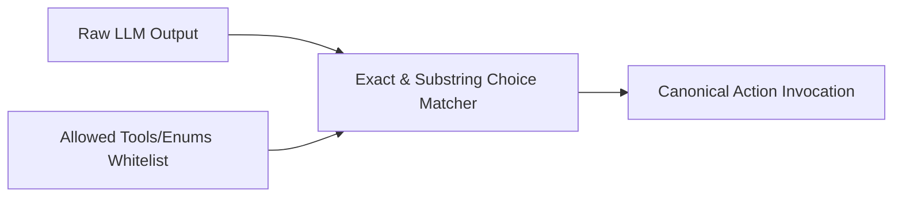

# genpark-enum-and-type-choice-constrained-decoder-skill

Action selection constraint filter mapping conversational agent responses to canonical API endpoints and tool names.

## Architecture

## Features
- **Anti-Hallucination Guard**: Never permits non-whitelisted actions.
- **Pure Python**: 100% standard library.
